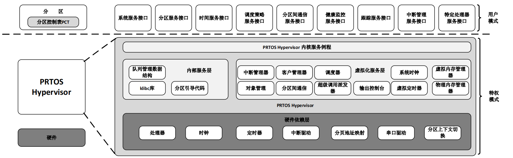

**English** | [中文](README_zh.md)

## Introduction
------------

**PRTOS Hypervisor** is a lightweight, open-source embedded hypervisor which aims at providing strong isolation and real-time guarantees. PRTOS provides a minimal implementation of separation kernel hypervisor architecture. 

Designed mainly for targeting mixed-criticality systems, prtos strongly focuses on isolation for fault-containment and real-time behavior. Its implementation comprises only a minimal, thin-layer of privileged software leveraging ISA para-virtualization. The main goal of PRTOS Hypervisor is to provide a virtualization platform that ensures isolation and predictability for critical applications running on embedded systems. It achieves this by using a type-1 hypervisor architecture, where the hypervisor runs directly on the hardware without the need for an underlying operating system.

PRTOS Hypervisor stands on the shoulders of giants, drawing inspiration from some classic open-source software projects such as [XtratuM](https://en.wikipedia.org/wiki/XtratuM), [Xen Hypervisor](https://xenproject.org/), [Lguest Hypervisor](http://lguest.ozlabs.org), and [Linux Kernel](https://www.linux.org/). Because of this, PRTOS Hypervisor is also released under the GPL license. Additionally, a book titled [Embedded Hypervisor: Architecture, Principles, and Implemenation](https://item.jd.com/10106992272683.html) has been published, offering a detailed introduction to the design and implementation techniques of PRTOS Hypervisor. This aims to facilitate a better understanding of PRTOS Hypervisor and foster an open community where students and enthusiasts interested in hypervisors can participate, thereby promoting the healthy evolution of PRTOS Hypervisor.

## PRTOS Hypervisor Architecture

PRTOS is a lightweight real-time hypervisor，Its architecture is as follows:




## PRTOS Hypervisor Features

 - Real-time capabilities: PRTOS Hypervisor is specifically designed for real-time and safety-critical applications, providing deterministic and predictable execution of tasks.

 - Partitioning and isolation: The hypervisor allows for the partitioning of resources, such as CPU, memory, and devices, into separate domains or partitions. Each partition can run its own real-time operating system and applications, ensuring isolation and fault containment.

 - Minimal footprint: PRTOS Hypervisor has a small memory footprint, making it suitable for resource-constrained embedded systems.

 - static resources configuration: PRTOS Hypervisor supports static configuration of partitions, resources are statically partitioned and assigned at VM instantiation time.

 - Inter-partition communication: PRTOS Hypervisor provides mechanisms for inter-partition communication, allowing partitions to exchange data and synchronize their activities.


**Currently supported platforms**
- [x] QEMU 32bit X86 platform
- [x] QEMU ARMv8 virt platform
- [x] QEMU RISC-V virt platform

**Plan to support platforms**
- [x] QEMU 64bit X86 platform(AMD64)
- [x] Raspberry Pi 4b/5b Single-board Computer


**PRTOS Hypervisor directory structure**
| Name          | Description                                             |
| ------------- | ------------------------------------------------------- |
| core          | The source code of the PRTOS Hypervisor.                |
| scripts       | The assist tools to configure PRTOS source code.        |
| user          | User space utilities (libprtos, tools, examples, etc).  |
| user/bail     | User' Bare-metal Application Interface Library.         |
| doc           | PRTOS related documents.                                 |

**NOTE**:BAIL(Bare-metal Application Interface Library) is a minimal partition developing environment for the development of "C" programs directly on top of PRTOS hypervisor. BAIL provides the basic and minimal services to setup a basic "C" execution environment. BAIL is useful for those partitions that are do not need an operating systems and want to do function test for PRTOS hypercall APIs.


# Getting Started


## **Development and Runtime Environment Setup**

### Common Dependencies Installation
```
# Basic compilation tools, version control, and scripting environment
sudo apt-get update
sudo apt-get install -y build-essential make perl gawk git subversion \
bc bison flex cpio unzip rsync wget makeself xorriso mtools \
python3-dev python3-setuptools python3-libxml2 \
libncurses5-dev libncurses-dev libssl-dev libxml2-dev libxml2-utils libgnutls28-dev \
gdb-multiarch
```
### x86 (i386/32-bit) Platform
#### Dependency Installation for x86 (i386/32-bit)

```
# 32-bit cross-compilation support, multi-arch libraries, and i386 emulator
sudo apt-get install -y gcc-multilib g++-multilib qemu-system-i386 \
grub-pc-bin
```

#### Compiling and Running PRTOS `helloworld` Example
```
cd prtos-hypervisor
cp prtos_config.x86 prtos_config
make defconfig
make
cd user/bail/examples/helloworld
make run.aarch64
```

The expected output is as follows:

```
P0 ("Partition0":0:1) flags: [ SYSTEM ]:
    [0x6000000:0x6000000 - 0x60fffff:0x60fffff] flags: 0x0
[0] Hello World!
[0] Verification Passed
[HYPERCALL] (0x0) Halted

```

### ARMv8 (AARCH64) Platform
#### Dependency Installation for ARMv8 (AARCH64)

```
sudo apt-get install -y gcc-aarch64-linux-gnu qemu-system-aarch64
sudo apt-get install u-boot-tools

```
#### Compiling and Running PRTOS `linux-smp` partition with 4 `vCPU`

```
git clone https://github.com/prtos-project/prtos-hypervisor.git
cd prtos-hypervisor
cp prtos_config.aarch64 prtos_config
make defconfig
make
cd user/bail/examples/linux_4vcpu_1partion
make run.aarch64
```
Log in with username `root` and password `1234`. The output is as follows:

```
Welcome to Buildroot
buildroot login: root
Password:
# uname -a
Linux buildroot 6.19.9-gc017ea9ffcd3 #2 SMP PREEMPT Sun Mar 22 19:36:34 CST 2026 aarch64 GNU/Linux
#
# cat /proc/cpuinfo | grep processor
processor       : 0
processor       : 1
processor       : 2
processor       : 3
#

```

### RISC-V 64 Platform
#### Dependency Installation for RISC-V 64

```
sudo apt-get install -y gcc-riscv64-linux-gnu device-tree-compiler qemu-system-misc

```

#### Compiling and Running PRTOS `linux-smp` partition with 4 `vCPU`
```
git clone https://github.com/prtos-project/prtos-hypervisor.git
cd prtos-hypervisor
cp prtos_config.riscv64 prtos_config
make defconfig
make
cd user/bail/examples/linux_4vcpu_1partion_riscv64
make run.riscv64
```
Log in with username `root` and password `1234`. The output is as follows:

```
Welcome to Buildroot
buildroot login: root
Password:
#uname -a
Linux buildroot 6.19.9-g2ca376b91049 #1 SMP Fri Mar 27 20:55:17 CST 2026 riscv64 GNU/Linux
#cat /proc/cpuinfo |grep processor
processor       : 0
processor       : 1
processor       : 2
processor       : 3

```

## **Commands to Automatically Run Test Suites for All Platforms**
```
chenweis@chenweis-M9-PRO:~/aarch64_port/prtos-hypervisor$ bash scripts/run_test.sh -h
Usage:
run_test.sh [options] <command>

Options:
  -h|--help              Display this help and exit.
  --arch <x86|aarch64>   Target architecture (default: x86).

Commands:
  check-<case>           Check a specific test case.
                         Available: helloworld, helloworld_smp,
                         example.001 ~ example.009,
                         freertos_para_virt (aarch64 only),
                         freertos_hw_virt (aarch64 only),
                         linux (aarch64 only),
                         linux_4vcpu_1partion (aarch64 only),
                         linux_4vcpu_1partion_riscv64 (riscv64 only),
                         mix_os_demo1 (aarch64 only),
                         mix_os_demo_riscv64 (riscv64 only)
  check-all              Check all test cases.

Examples:
  run_test.sh check-all                     # Run all x86 tests
  run_test.sh --arch aarch64 check-all      # Run all AArch64 tests
  run_test.sh --arch aarch64 check-001      # Run single AArch64 test
  run_test.sh check-helloworld              # Run x86 helloworld test

```
## **Expected Test Reports**


The test report of run `bash scripts/run_test.sh --arch x86 check-all` should be:
```
======================================
  Test Report [x86]
======================================
  example.001          PASS
  example.002          PASS
  example.003          PASS
  example.004          PASS
  example.005          PASS
  example.006          PASS
  example.007          PASS
  example.008          PASS
  example.009          PASS
  helloworld           PASS
  helloworld_smp       PASS
  freertos_para_virt   SKIP
  freertos_hw_virt     SKIP
  freertos_para_virt_riscv SKIP
  freertos_hw_virt_riscv SKIP
  linux                SKIP
  linux_4vcpu_1partion SKIP
  linux_4vcpu_1partion_riscv64 SKIP
  mix_os_demo1         SKIP
  mix_os_demo_riscv64  SKIP
--------------------------------------
  Total: 20  Pass: 11  Fail: 0  Skip: 9
======================================

```

The test report of run `bash scripts/run_test.sh --arch aarch64 check-all` should be:
```

======================================
  Test Report [aarch64]
======================================
  example.001          PASS
  example.002          PASS
  example.003          PASS
  example.004          PASS
  example.005          PASS
  example.006          PASS
  example.007          PASS
  example.008          PASS
  example.009          PASS
  helloworld           PASS
  helloworld_smp       PASS
  freertos_para_virt   PASS
  freertos_hw_virt     PASS
  freertos_para_virt_riscv SKIP
  freertos_hw_virt_riscv SKIP
  linux                PASS
  linux_4vcpu_1partion PASS
  linux_4vcpu_1partion_riscv64 SKIP
  mix_os_demo1         PASS
  mix_os_demo_riscv64  SKIP
--------------------------------------
  Total: 20  Pass: 16  Fail: 0  Skip: 4
======================================

```

The test report of run `bash scripts/run_test.sh --arch riscv64 check-all` should be:
```
======================================
  Test Report [riscv64]
======================================
  example.001          PASS
  example.002          PASS
  example.003          PASS
  example.004          PASS
  example.005          PASS
  example.006          PASS
  example.007          PASS
  example.008          PASS
  example.009          PASS
  helloworld           PASS
  helloworld_smp       PASS
  freertos_para_virt   SKIP
  freertos_hw_virt     SKIP
  freertos_para_virt_riscv PASS
  freertos_hw_virt_riscv PASS
  linux                SKIP
  linux_4vcpu_1partion SKIP
  linux_4vcpu_1partion_riscv64 PASS
  mix_os_demo1         SKIP
  mix_os_demo_riscv64  PASS
--------------------------------------
  Total: 20  Pass: 15  Fail: 0  Skip: 5
======================================

```

[PRTOS Hypervisor Programming Guide](http://www.prtos.org/prtos_hypervisor_x86_user_guide/) | [PRTOS Hypervisor Samples](https://github.com/prtos-project/prtos-hypervisor/tree/main/user/bail/examples)

[Debug the PRTOS Hypervisor and assistant tools](doc/debug/how_to_debug_prtos_hypervisor_and_assistant_tools.md)

# Community

PRTOS Hypervisor is very grateful for the support from all community developers, and if you have any ideas, suggestions or questions in the process of using PRTOS Hypervisor, PRTOS Hypervisor can be reached by the following means, and we are also updating PRTOS Hypervisor in real time on these channels. At the same time, any questions can be asked in the [issue section of PRTOS Hypervisor repository](https://github.com/prtos-project/prtos-hypervisor/issues) or [PRTOS Hypervisor forum](http://www.prtos.org), and community members will answer them.

# Contribution

If you are interested in PRTOS Hypervisor and want to join in the development of PRTOS Hypervisor and become a code contributor,please refer to the [Code Contribution Guide](doc/contribution_guide/contribution_guide.md).
