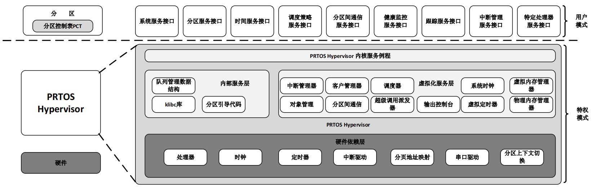

**English** | [中文](README_zh.md)

## Introduction
------------

**PRTOS Hypervisor** is a lightweight, open-source embedded hypervisor which aims at providing strong isolation and real-time guarantees. PRTOS provides a minimal implementation of separation kernel hypervisor architecture. 

Designed mainly for targeting mixed-criticality systems, prtos strongly focuses on isolation for fault-containment and real-time behavior. Its implementation comprises only a minimal, thin-layer of privileged software leveraging ISA para-virtualization. The main goal of PRTOS Hypervisor is to provide a virtualization platform that ensures isolation and predictability for critical applications running on embedded systems. It achieves this by using a type-1 hypervisor architecture, where the hypervisor runs directly on the hardware without the need for an underlying operating system.

PRTOS Hypervisor stands on the shoulders of giants, drawing inspiration from some classic open-source software projects such as [XtratuM](https://en.wikipedia.org/wiki/XtratuM), [Xen Hypervisor](https://xenproject.org/), [Lguest Hypervisor](http://lguest.ozlabs.org), and [Linux Kernel](https://www.linux.org/). Because of this, PRTOS Hypervisor is also released under the GPL license. Additionally, a book titled [Embedded Hypervisor: Architecture, Principles, and Implemenation](https://item.jd.com/10106992272683.html) has been published, offering a detailed introduction to the design and implementation techniques of PRTOS Hypervisor. This aims to facilitate a better understanding of PRTOS Hypervisor and foster an open community where students and enthusiasts interested in hypervisors can participate, thereby promoting the healthy evolution of PRTOS Hypervisor.

## PRTOS Hypervisor Architecture

PRTOS is a lightweight real-time hypervisor，Its architecture is as follows:

## PRTOS Hypervisor Features

 - Real-time capabilities: PRTOS Hypervisor is specifically designed for real-time and safety-critical applications, providing deterministic and predictable execution of tasks.

 - Partitioning and isolation: The hypervisor allows for the partitioning of resources, such as CPU, memory, and devices, into separate domains or partitions. Each partition can run its own real-time operating system and applications, ensuring isolation and fault containment.

 - Minimal footprint: PRTOS Hypervisor has a small memory footprint, making it suitable for resource-constrained embedded systems.

 - static resources configuration: PRTOS Hypervisor supports static configuration of partitions, resources are statically partitioned and assigned at VM instantiation time.

 - Inter-partition communication: PRTOS Hypervisor provides mechanisms for inter-partition communication, allowing partitions to exchange data and synchronize their activities.

**Currently supported platforms**
- [x] QEMU 32bit X86 platform

**Plan to support platforms**
- [x] QEMU ARMv8 virt platform
- [x] Raspberry Pi 4b/5b Single-board Computer
- [x] QEMU RISC-V virt platform

**PRTOS Hypervisor directory structure**
| Name          | Description                                             |
| ------------- | ------------------------------------------------------- |
| core          | The source code of the PRTOS Hypervisor.                |
| scripts       | The assist tools to configure PRTOS source code.        |
| user          | User space utilities (libprtos, tools, examples, etc).  |
| user/bail     | User' Bare-metal Application Interface Library.         |
| doc           | PRTOS related documents.                                 |

**NOTE**:BAIL(Bare-metal Application Interface Library) is a minimal partition developing environment for the development of "C" programs directly on top of PRTOS hypervisor. BAIL provides the basic and minimal services to setup a basic "C" execution environment. BAIL is useful for those partitions that are do not need an operating systems and want to do function test for PRTOS hypercall APIs.

# Getting Started

[PRTOS Hypervisor Programming Guide](http://www.prtos.org/prtos_hypervisor_x86_user_guide/) | [PRTOS Hypervisor Samples](https://github.com/prtos-project/prtos-hypervisor/tree/main/user/bail/examples)

[Debug the PRTOS Hypervisor and assistant tools](doc/debug/how_to_debug_prtos_hypervisor_and_assistant_tools.md)

# Community

PRTOS Hypervisor is very grateful for the support from all community developers, and if you have any ideas, suggestions or questions in the process of using PRTOS Hypervisor, PRTOS Hypervisor can be reached by the following means, and we are also updating PRTOS Hypervisor in real time on these channels. At the same time, any questions can be asked in the [issue section of PRTOS Hypervisor repository](https://github.com/prtos-project/prtos-hypervisor/issues) or [PRTOS Hypervisor forum](http://www.prtos.org), and community members will answer them.

[Website](http://www.prtos.org)

# Contribution

If you are interested in PRTOS Hypervisor and want to join in the development of PRTOS Hypervisor and become a code contributor,please refer to the [Code Contribution Guide](doc/contribution_guide/contribution_guide.md).
