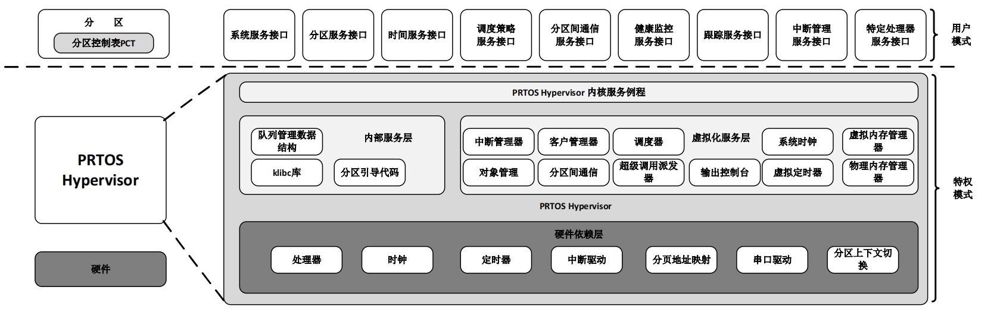

[English](README.md) | **中文** 

## 简介

PRTOS是一款轻量级、开源嵌入式嵌入式Type 1 Hypervisor，旨在通过虚拟化技术实现安全高效的嵌入式实时系统。它允许不同的应用程序通过分区的时间和空间隔离来共享相同的硬件平台。PRTOS对系统资源进行分区虚拟化，包括CPU、内存和I/O设备，以确保系统安全，并防止应用程序之间的干扰。PRTOS采用分离内核架构实现，其中PRTOS内核在特权模式下运行，并为硬件和分区之间提供抽象层。

PRTOS的分区被定义为独立的执行环境，可以独立且安全地运行。它们按照预定义的循环调度表进行调度，分区之间的通信通过消息传递实现。PRTOS支持两种类型的分区：系统分区和标准分区，只有系统分区具有控制系统和其他分区状态的能力。

PRTOS还提供了多种其他功能，如细粒度的错误检测系统、故障管理、高级故障分析技术和高度可配置的健康监测系统。它还提供了一个跟踪服务，用于实时调试分区和监视系统行为。

PRTOS Hypervisor 站在巨人们的肩膀上实现，主要借鉴了一些经典开源软件项目，比如[XtratuM](https://en.wikipedia.org/wiki/XtratuM), [Xen Hypervisor](https://xenproject.org/),  [Lguest Hypervisor](http://lguest.ozlabs.org), 以及[Linux Kernel](https://www.linux.org/ )等开源软件项目，正因为如此PRTOS Hypervisor 以GPL许可证的方式发布, 同时一本与之配套的图书[《嵌入式Hypervisor：架构、原理与应用》](https://item.jd.com/10106992272683.html)详细介绍PRTOS Hypervisor的设计与实现技术，以方便大家更好的理解PRTOS Hypervisor，同时也希望借此形成一个PRTOS Hypervisor的开放社区，让更多的对Hypervisor感兴趣的同学和爱好者参与进来，以促进PRTOS Hypervisor的健康演化。尤其是后续对ARM-V8，RISC-V架构的支持，以及更多分区应用的适配。

## **PRTOS Hypervisor架构**

PRTOS Hypervisor架构如下：

## PRTOS Hypervisor的特点

- 实时性能：PRTOS Hypervisor专门为实时和安全关键应用程序设计，确保提供服务的确定性和可预测性。
- 分区和隔离：PRTOS将资源（如CPU、内存和设备）划分为单独的分区。每个分区可以运行自己的实时操作系统和应用程序，确保隔离和容错。
- 小内存占用：PRTOS Hypervisor具有较小的内存占用，适用于资源有限的嵌入式系统。
- 分区间通信：PRTOS Hypervisor提供了分区间通信的机制，允许分区交换数据并同步其活动。

## **代码目录**

PRTOS Hypervisor源代码目录结构如下图所示：

| 名称          | 描述                                                    |
| ------------  | -------------------------------------------------------|
| core          | PRTOS Hypervisor核心源码。                              |
| scripts       | 配置PRTOS Hypervisor的辅助工具。                         |
| user          | 用户级别工具。                                           |
| user/bail     | 用户裸机应用程序接口库。                                  |
| doc           | 相关文档。                                               |

**NOTE**:BAIL（Bare-metal Application Interface Library）是一个用于在PRTOS Hypervisor之上直接开发C程序的最小分区开发环境。BAIL提供了建立基本的"C"执行环境所需的基本服务。BAIL适用于那些不需要操作系统的分区、以及测试PROTS提供的超级调用服务接口。

[PRTOS用户手册](http://www.prtos.org/prtos_hypervisor_x86_user_guide/)

# 资源文档

## **硬件支持**

- [x] QEMU或者VMware 32位 X86平台

## 文档

[文档中心](http://www.prtos.org ) | [编程指南](http://www.prtos.org/prtos_hypervisor_x86_user_guide/)

## 例程

[裸机应用示例](http://www.prtos.org/prtos_hypervisor_x86_user_guide/)  | [虚拟化Linux示例](https://github.com/prtos-project/prtos-demo/tree/main/partition_linux ) | [虚拟化uC/OS-II示例](https://github.com/prtos-project/prtos-demo/tree/main/partition_ucosii) | [虚拟化Linux内核源](https://github.com/prtos-project/prtos-linux-3.4.4) | [PRTOS Hypervisor API参考手册](http://www.prtos.org )

# 社区支持

PRTOS Hypervisor非常感谢所有社区小伙伴的支持，在阅读和开发PRTOS Hypervisor的过程中若您有任何的想法，建议或疑问都可通过以下方式联系到 PRTOS Hypervisor，我们也实时在这些频道更新PRTOS Hypervisor的最新讯息。同时，任何问题都可以在 [论坛](https://github.com/prtos-project/prtos-hypervisor/issues) 中提出，社区成员将回答这些问题。

[官网]( http://www.prtos.org) 

# 贡献代码

如果您对PRTOS Hypervisor感兴趣，并希望参与PRTOS的开发并成为代码贡献者，请参阅[代码贡献指南](doc/contribution_guide/contribution_guide_zh.md)。
